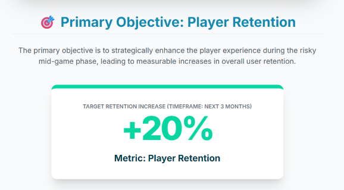
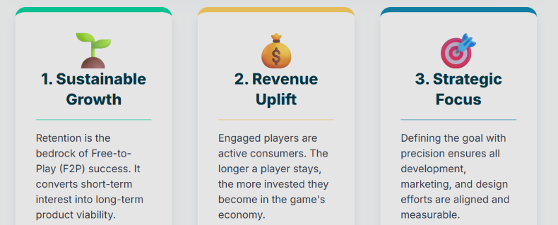
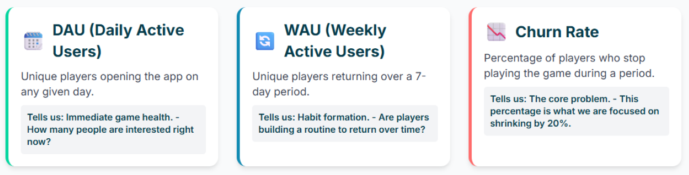
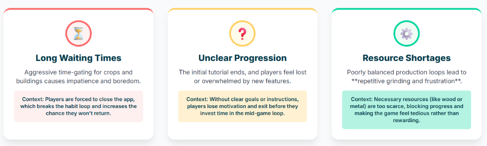

# 🌾 FarmDale Portfolio  

This repository showcases the **FarmDale Market Challenges Infographic** and product strategy case study.

---

## 📂 Project Pages
- [About The Game](MarketAndNiche.html)  
- [FarmDale's Revenue Model](RevenueModelAndAdvantages.html)  
- [Key Business & Design Challenges (Infographic)](infographic.html)  

---

## 🚀 Product Strategy Case Study: FarmDale Retention Improvement

This repository outlines a **focused strategy to reduce player drop-off** in the mid-to-late stages of FarmDale, ensuring **long-term player loyalty** and maximizing revenue potential.

---

### 🎯 Goal & Executive Summary

The primary objective is to **enhance the player experience during risky mid-game phases**, leading to measurable increases in overall user retention.

| **Metric** | **Target** | **Timeframe** |
|------------|------------|---------------|
| Player Retention | +20% Increase | Next 3 Months |

---

### 💡 Why This Goal is Critical

- **Sustainable Growth:** Retention is fundamental for success in free-to-play (F2P) games. Improved retention increases **lifetime value (LTV)** of each player.  
- **Revenue Uplift:** Higher engagement creates more opportunities for **in-app purchases (IAPs)**.  
- **Strategic Focus:** The goal is **S.M.A.R.T.** (Specific, Measurable, Achievable, Relevant, Time-bound), giving clear direction for the product team.

---

### 🛠️ Strategy to Achieve the Goal: 5-Step Framework

Our approach focuses on **targeted interventions** based on player data and psychological triggers.

#### **1. Analyze Current Retention Metrics**
Establish a precise data baseline to identify when and where players leave the game.  

**Metrics to track:**  

- **DAU (Daily Active Users):** Unique players per day. Shows immediate game health.  
- **WAU (Weekly Active Users):** Unique players per 7 days. Reflects medium-term engagement.  
- **Churn Rate:** Percentage of players who stop playing during a period. Core problem we aim to reduce.  

**Identify high-dropoff points:**  
- Example: Level 32, Level 45, or after unlocking key features like the Cauldron machine.

---

#### **2. Identify Pain Points**
Focus on the **3 major player frustrations** that lead to quitting:

- **Long waiting times for crops/buildings:** Aggressive time-gating can cause impatience and boredom.  
- **Confusing tutorials or unclear progression:** Players may feel lost after the initial tutorial.  
- **Resource shortages limiting gameplay:** Poorly balanced loops force repetitive grinding and frustration.

---

#### **3. Implement Solutions**
Deploy **targeted feature changes** to address the pain points:

- **Daily Mini-Rewards:** Encourage habitual play with a **robust daily streak system**.  
- **Faster Early-Level Progression:** Reduce XP/time for Levels 1–15 to hook new players quickly.  
- **Special Events/Challenges:** Short-term high-reward events (e.g., “Village Trade Fair”) to motivate mid-to-late game players.

---

#### **4. Test & Iterate**
Use **statistical testing** to ensure strategies are effective:

- **A/B Testing:** Compare two versions (e.g., faster crops vs. bonus rewards) to identify what improves retention the most.  
- **Example:** Measure retention impact of faster crop growth versus resource bonus rewards.

---

#### **5. Measure Success**
Continuous monitoring and adaptation:

- **Track DAU, WAU, and churn weekly:** Compare against baseline to quantify improvements.  
- **Adjust strategies:** If D30 retention rises but D7 remains flat, refine daily habit loops to optimize engagement.

---

## 📈 Expected Outcome

- **Stronger Engagement:** Players spend more time and return regularly, forming a predictable habit.  
- **Increased Monetization Opportunities:** More engaged audience = more chances for IAPs and social interactions.  
- **Long-Term Loyalty:** Reduce frustration and replace repetitive tasks with rewarding events, sustaining the game for years.

---
[Back to Portfolio](https://meghana-ps07.github.io/portfolio/) 

